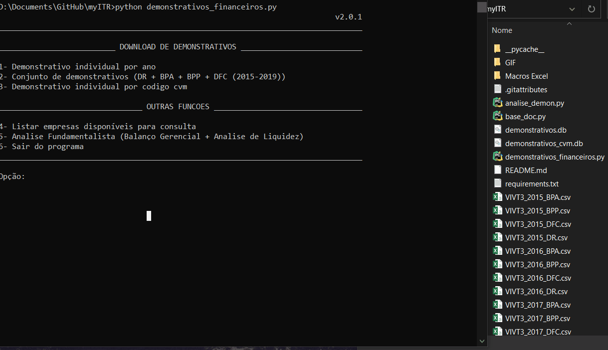

## MyITR
 * O projeto foi desenvolvido para a busca de demonstrativos financeiros de empresas de capital aberto supervisionadas pela CVM.
 * Os demonstrativos disponíveis são: Demonstração de Resultado, Balanço Patrimonial Ativo, Balanço Patrimonial Passivo e Demonstrações de Fluxo de Caixa.
 * Como função adicional o programa possui uma função para implementação de planilhas baseadas na análise fundamentalista (Balanço Gerencial e Análise de Liquidez)

### Requirements
 * **[Python 3.x](https://www.python.org/downloads/)**
 * **Bibliotecas python- pip install requirements.txt**
 * **Microsoft Excel 2016**

### Arquivos do diretório
  * **Macros Excel** - Essa pasta contem os códigos raw de macros para utilização no excel
      1. BP_INDIVIDUAL - Formata os arquivos **individuais** de Balanço Patrimonial (BPA e BPP)
      2. DR_DFC_INDIVIDUAL - Formata os arquivos **individuais** de Demonstração de Resultados (DR) e Demonstração de Fluxos de Caixa (DFC)
      3. BP_COMP - Formata os arquivos **compilados** de Balanço Patrimonial (BPA e BPP)
      4. DR_DFC_COMP - Formata os arquivos **compilados** de Demonstração de Resultados (DR) e Demonstração de Fluxos de Caixa (DFC)
  * **base_doc.py** - Funções para comunicação com o banco de dados
  * **analise_demon.py** - Funções para a criação das tabelas de analise
  * **demonstrativos_financeiros.py** - Programa principal - pode ser executado no cmd/terminal > python myInvest.py
  * **demonstrativos.db** - Banco de dados simples
  * **demonstrativos_cvm.db** - Banco de dados com informações disponibilizadas pela CVM

### Passo a Passo
  1. **Execução do programa:**
      1. Navegue até o direório onde o programa foi baixado
      2. Executar o programa a partir do cmd/terminal com o comando --> python demonstrativos_financeiros.py
      3. A execução correta do programa resultará em um ou mais arquivos csv ou xlsx.
      4. O arquivo csv gerado é intitulado como ticker_ano_demonstrativo.csv (ex: MGLU3_2019_DR.csv)
  2. **Opções de Execução**
      1. 1- Demonstrativo individual por ano
          1. Será solicitado ticker, ano e demonstrativo
          2. O resultado será um arquivo contendo o demonstrativo individual do período solicitado
          3. Essa opção só está disponível para as empresas listadas (Opção 4)
      2. 2- Conjunto de demonstrativos (DR + BPA + BPP + DFC (2015-2019))
          1. Será solicitado o ticker da empresa.
          2. O resultado será o conjunto de todos os demonstrativos individuais em no periodo 2015-2019 (total de 20 arquivos)
          3. Essa opção só está disponível para as empresas listadas (Opção 4)
      3. 3- Demonstrativo individual por código cvm
          1. Serão solicitados: ticker, codigo cvm, ano, trimestre, versao, demonstrativo
          2. O resultado será um arquivo contendo o demonstrativo individual do período solicitado 
          3. Essa é a opção mais completa e específica, ja que está disponível para todas as empresas listadas na cvm
      4. 4- Listar empresas disponíveis para consulta
          1. Essa opção retornará todas as empresas disponíveis para a utilização das opções 1 e 2
      5. 5- Análise Fundamentalista
          1. Após a execução da opção 2 (Conjunto de demonstrativos) será possível compilar os resultados por demonstrativo
          2. O arquivo resultado (ticker_analise.xlsx) possuirá o compilado dos anos 2015-2019 de todos os demonstrativos, adicionando tambem duas novas planilhas referentes à: Balanço Gerencial e Análise de Rentabilidade

   | Execução do programa |
   | :------: |
   |  |
  3. **Formatação Excel**
      1. O projeto acompanha macros do excel para uma formatação automática dos arquivos gerados
      2. Importe as macros para seu Excel
      3. Para arquivos excel referentes ao demonstrativo:
          * BPP ou BPA individuais: utilizar a macro BP_INDIVIDUAL
          * DR ou DFC individuais: utilizar a macro DR_DFC_INDIVIDUAL
          * BPP ou BPA compilados: utilizar a macro BP_COMP
          * DR ou DFC compilados: utilizar a macro DR_DFC_COMP

  | Aplicação da macro |
  | :------: |
  
  
  3. **Análise Fundamentalista**
      1. O projeto acompanha macros do excel para uma formatação automática dos arquivos gerados

  | Análise Fundamentalista |
  | :------: |
  
