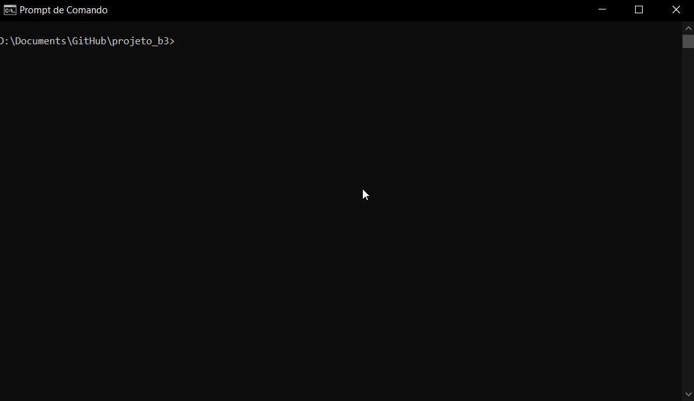
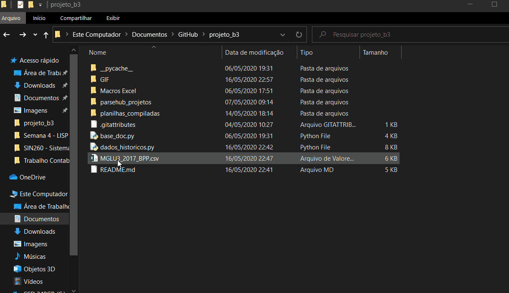

## projeto_b3 -> Dados Históricos
 * O projeto foi desenvolvido para automatização na análise de investimentos a partir de dados históricos como: Demonstração de Resultado, Balanço Patrimonial Ativo e Balanço Patrimonial Passivo.
 * Esse programa foi construído para a matéria SIN311 - Contabilidade em Informática (UNIFEI - Sistemas da Informação)

 No momento estão disponíveis os dados das empresas:
 * **MGLU3** - MAGAZINE LUIZA S.A.
 * **EMBR3** - EMBRAER S.A.
 * **CVCB3** - CVC BRASIL OPERADORA E AGÊNCIA DE VIAGENS S.A.
 * **LREN3** - LOJAS RENNER S.A.
 * **OIBR4** - OI S.A.
 * **CGAS5** - CIA GAS DE SAO PAULO - COMGAS
 * **VVAR3** - VIA VAREJO S.A.
 * **WHRL3** - WHIRLPOOL S.A.

### Requirements
 * **[Python 3.x](https://www.python.org/downloads/)**
 * **requests -> (no cmd execute o comando: pip install requests)**
 * time -> pip install time
 * sys -> pip install sys
 * **Microsoft Excel 2016**

### Arquivos do diretório
  * **Macros Excel** - Essa pasta contem os códigos raw para utilizção no excel
      1. BP_B3_Blazzi - Formata os arquivos de Balanço Patrimonial (BPA e BPP)
      2. DR_B3_Blazzi - Formata os arquivos de Demonstração de Resultados (DR)
      3. DFC_B3_Blazzi - Formata os arquivos de Demonstração de Fluxos de Caixa (DFC)
  * **base_doc.py** - Dados utilizados para buscar os demonstrativos financeiros de cada empresa.
      1. Para adicionar um novo dado basta seguir o template nos arquivos
      2. No site da b3 cada empresa em determinado ano possui uma variavel chamada NumeroSequencialDocumento que pode ser encontrada na URL do demonstrativo
  * **dados_historicos.py** - Programa principal - pode ser executado no cmd/terminal > python dados_historicos.py

### Passo a Passo
  1. **Execução do programa:**
      1. Executar o programa a partir do cmd/terminal com o comando --> python dados_historicos.py
      2. A execução correta do programa resultará em um arquivo csv.
      3. O arquivo csv gerado é entitulado como ticker_ano_demonstrativo.csv (ex: MGLU3_2019_DR)
      
  2. **Formatação Excel**
      1. O projeto acompanha macros do excel para uma formatação automática na pasta "Macros Excel"
      2. Importe as macros para seu Excel
      3. Para arquivos excel referentes ao demonstrativo:
          * BPP ou BPA: utilizar a macro BP_B3_Blazzi
          * DR: utilizar a macro DR_B3_Blazzi
          * DFC: utilizar a macro DFC_B3_Blazzi
      
